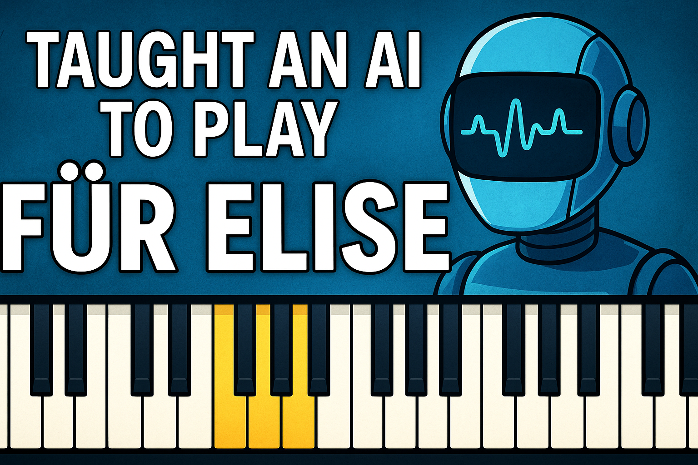

# 🎹 AI Learns to Play Für Elise (Beethoven) Using Reinforcement Learning

This project trains an AI agent to learn and play the iconic melody of **Für Elise** by Ludwig van Beethoven — completely from scratch — using reinforcement learning and audio feedback.



---

## 📽️ Watch the Video
> 👉 [YouTube Link Coming Soon]

---

## 🧠 How It Works

- **Algorithm:** Proximal Policy Optimization (PPO) via [Stable-Baselines3](https://github.com/DLR-RM/stable-baselines3)
- **Environment:** Custom Gymnasium-compatible piano simulator
- **Audio Feedback:** Real .mp3 piano notes played with `pygame.mixer`
- **Visual Feedback:** Live piano key display with note highlights

---

## 🎵 Melody Target: Für Elise (Simplified Intro)

```python
TARGET_MELODY = [
    'E5', 'D#5', 'E5', 'D#5', 'E5', 'B4', 'D5', 'C5', 'A4',
    'C4', 'E4', 'A4', 'B4', 'E4',
    'G#4', 'B4', 'C5',
    'E4', 'E5', 'D#5', 'E5', 'D#5', 'E5', 'B4', 'D5', 'C5', 'A4',
    'C4', 'E4', 'A4', 'B4', 'E4'
]
```

---

## 🚀 Getting Started

### 1. Clone the Repo

```bash
git clone https://github.com/your-username/ai-piano-fur-elise.git
cd ai-piano-fur-elise
```

### 2. Install Dependencies

```bash
pip install -r requirements.txt
```

> 💡 You’ll need:
> - Python 3.8+
> - `stable-baselines3`
> - `gymnasium`
> - `pygame`

### 3. Add Piano Sounds

Drop `.mp3` note files (like `E5.mp3`, `D#5.mp3`, etc.) into the `/sounds` folder.  
Use the [fuhton/piano-mp3](https://github.com/fuhton/piano-mp3) repo for clean piano samples.

---

## 🎯 Training

```bash
python main.py
```

This trains the PPO agent to match the target melody using positive/negative rewards.

---

## 🎧 Playback

Once trained:

```bash
python play_trained.py
```

You'll hear the AI’s final performance (and see the keys light up visually).

---

## 📦 Project Structure

```
├── main.py              # PPO training loop
├── play_trained.py      # Playback the trained melody
├── piano_env.py         # Gymnasium piano environment
├── melody_reward.py     # Melody + reward calculation
├── utils.py             # Note playback + helpers
├── visual_piano.py      # Optional live piano UI
├── sounds/              # Folder for .mp3 piano notes
├── logs/                # Training logs
├── thumbnail.png        # YouTube/GitHub visual thumbnail
```

---

## 📚 Inspiration

- [Beethoven's Für Elise sheet music](https://musescore.com/classicman/scores/17620)
- [OpenAI Gym](https://gymnasium.farama.org/)
- [Stable-Baselines3](https://github.com/DLR-RM/stable-baselines3)

---
